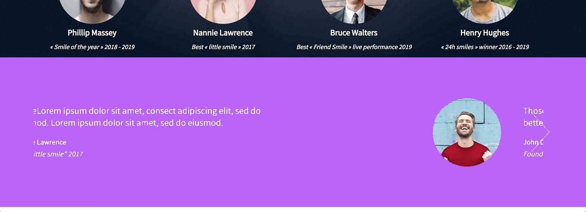
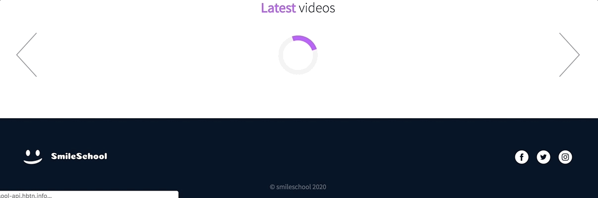

In this project, you will finalize the previous project 0x0B. Implement a design with bootstrap and make some parts dynamic with Javascript (JQuery exactly).

You will reuse final files of 0x0B. Implement a design with bootstrap and update them.

You will use all HTML/CSS/Accessibility/Responsive design/Bootstrap/Javascript knowledges that you learned previously.

You won’t have a lot of instruction, you are free to implement it the way that you want - the objective is simple: Have fully functional web pages that look the same as the designer file.

Here the final result:


# Requirements

- You have to use Bootstrap
- Your styles.css must be as small as you can - you must use as much as you can Bootstrap classes
- You have to use JQuery
- Your scripts.js must contain all your Javascript part
- Your Javascript must be executed only when the document is loaded

# Imports

For this project, you will need: fonts from Google, JQuery, Bootstrap CSS/JS

```sh
<link href="https://fonts.googleapis.com/css?family=Source+Sans+Pro&display=swap" rel="stylesheet">
<link href="https://fonts.googleapis.com/css?family=Coiny&display=swap" rel="stylesheet">

<script src="https://code.jquery.com/jquery-3.4.1.min.js" integrity="sha256-CSXorXvZcTkaix6Yvo6HppcZGetbYMGWSFlBw8HfCJo=" crossorigin="anonymous"></script>
<script src="https://stackpath.bootstrapcdn.com/bootstrap/4.4.1/js/bootstrap.min.js" integrity="sha384-wfSDF2E50Y2D1uUdj0O3uMBJnjuUD4Ih7YwaYd1iqfktj0Uod8GCExl3Og8ifwB6" crossorigin="anonymous"></script>
<script src="https://cdnjs.cloudflare.com/ajax/libs/popper.js/1.12.9/umd/popper.min.js" integrity="sha384-ApNbgh9B+Y1QKtv3Rn7W3mgPxhU9K/ScQsAP7hUibX39j7fakFPskvXusvfa0b4Q" crossorigin="anonymous"></script>

<link rel="stylesheet" href="https://stackpath.bootstrapcdn.com/bootstrap/4.4.1/css/bootstrap.min.css" integrity="sha384-Vkoo8x4CGsO3+Hhxv8T/Q5PaXtkKtu6ug5TOeNV6gBiFeWPGFN9MuhOf23Q9Ifjh" crossorigin="anonymous">

<link rel="stylesheet" href="styles.css">
<script src="scripts.js"></script>
```

# Tasks


**0. Reuse and polish your Bootstrap integration**

Files: [README.md](README.md/) - [0-homepage.html](0-homepage.html/) - [0-pricing.html](0-pricing.html/) - [0-courses.html](0-courses.html/) - [styles.css](styles.css/)

Copy files from 0x0B. Implement a design with bootstrap:

- homepage.html -> 0-homepage.html
- pricing.html -> 0-pricing.html
- courses.html -> 0-courses.html
- styles.css and any files/folders needed (images, fonts…)

And finalize the design if it’s not done yet - the final result should be the same as these screens:

- [Homepage - fig file](https://www.figma.com/file/QYQqMYbdpAHL5xTclwJKSI/Homepage)
- [Pricing - fig file](https://www.figma.com/file/KLAI53jdYpfFNEy0O79ymB/Pricing)
- [Courses - fig file](https://www.figma.com/file/ivg3abH1HLmMayBgjGg1Qf/Courses)

And “Duplicate to your Drafts” to have access to all design details.

Important notes with Figma:

- if your computer doesn’t have missing fonts, you can find them here: source-sans-pro and Spin-Cycle-OT
- some values are in float - feel free to round them
- “Be pixel perfect” - yes! but mainly make sure colors, size and position are correct. #C271FF is not purple.

For this task, please write an amazing README.md

**Interactions note:**

- Web pages must switch to the tablet version when the screen width is 768px
- Web pages must switch to the mobile version when the screen width is 576px
- button hover/active: opacity: 0.9


**1. Homepage - quotes**

Files: [1-homepage.html](1-homepage.html/)

Replace static quotes by dynamic loading:

- URL: https://smileschool-api.hbtn.info/quotes
- No static quotes should be present in the quotes section
- During the Ajax request, a loader should be present
- Carousel should work like before

Example of my loader:

```sh
HTML:
<div class="loader"></div>

CSS:
.loader {
    border: 10px solid #f3f3f3;
    border-top: 10px solid #C271FF;
    border-radius: 50%;
    width: 80px;
    height: 80px;
    animation: spin 2s linear infinite;
    margin: auto;
}

@keyframes spin {
    0% { transform: rotate(0deg); }
    100% { transform: rotate(360deg); }
}
```

Final result:




**2. Homepage - popular tutorials**

Files: [2-homepage.html](2-homepage.html/)

Replace static video cards by dynamic loading:

- URL: https://smileschool-api.hbtn.info/popular-tutorials
- No static video cards should be present in the section
- During the Ajax request, a loader should be present
- Carousel should work by sliding card by card (like GIF below) - this kind of carousel is not unique, make it generic to reuse it easily!
- Don’t forget the responsive part!

Final result:


**3. Homepage - latest videos**

Files: [homepage.html](homepage.html/)

From 2-homepage.html, create homepage.html.

Replace static video card by dynamic loading:

- URL: https://smileschool-api.hbtn.info/latest-videos
- No static video cards should be present in the section
- During the Ajax request, a loader should be present
- Carousel should work by sliding card by card (like GIF below) - this kind of carousel is not unique, make it generic to reuse it easily!
- Don’t forget the responsive part!

Final result:




**4. Pricing - quotes**

Files: [pricing.html](pricing.html/)

From 0-pricing.html, create pricing.html.

Replace static quotes by dynamic loading:

- URL: https://smileschool-api.hbtn.info/quotes
- No static quotes should be present in the quotes section
- During the Ajax request, a loader should be present
- Carousel should work like before
- Same as the homepage.html


**5. Courses**

Files: [courses.html](courses.html/)

From 0-courses.html, create courses.html.

Replace static video card by dynamic loading:

- URL: https://smileschool-api.hbtn.info/courses
> - GET parameters:
> > - q: search value (in our case, the value of the field KEYWORDS)
> > - topic: topic filter value (in our case, the value of the field TOPICS)
> > - sort: order of all courses (in our case, the value of the field SORT BY)
- No static video cards should be present in the section
- During the Ajax request, a loader should be present
- Dropdowns are dynamic (coming from the API):
> - Topic: list of topics
> - Sort by: list of sorts
- Search value should be initialized by the value q in the API response
- The list of video cards is coming from courses in the API response
- API request must be done when:
> - Search value is changing
> - A new Topic is selected
> - A new Sort by is selected


**6. JSON to XML**

Files: [xml-scripts.js](xml-scripts.js/) - [xml-homepage.html](xml-homepage.html/) - [xml-pricing.html](xml-pricing.html/) - [xml-courses.html](xml-courses.html/)

Convert all your JSON Ajax call to another API… a XML API!

Copy files - same content, except loading xml-scripts.js instead of script.js

- homepage.html -> xml-homepage.html
- pricing.html -> xml-pricing.html
- courses.html -> xml-courses.html

And use this API:

- quotes: https://smileschool-api.hbtn.info/xml/quotes
- popular tutorials: https://smileschool-api.hbtn.info/xml/popular-tutorials
- latest videos: https://smileschool-api.hbtn.info/xml/latest-videos
- courses: https://smileschool-api.hbtn.info/xml/courses

Final result should be the same as the JSON API version


## :sagittarius: Author

> :man: Kevin Castro

> :e-mail: [E-mail](bracaspin@gmail.com)

> :octocat: [Github](https://github.com/KevinCastroP)

> :bird: [Twiiter](https://twitter.com/ccali_k)

> :blue_book: [Linkedin](https://www.linkedin.com/in/kevin-brandown-castro-/)

> :globe_with_meridians: [WebPage](https://kevincastrop.github.io/KC/)
